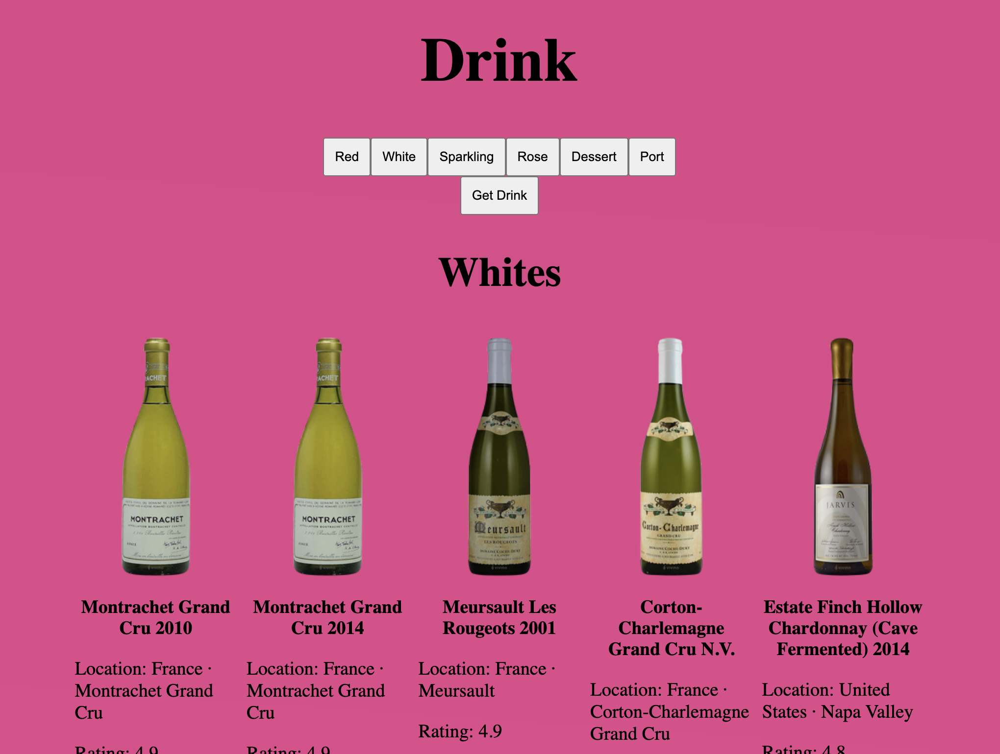

# Wine Cellar React

React application to explore the implementation of useState, Fetch, and map functions. The app utilizes SampleApi to retrieve the necessary data--sans useEffect(). Class course for C-11.

 

## Website
* 👉 [jsohndata.github.io/wine-cellar](https://jsohndata.github.io/wine-cellar/)

 

## Features
* useState()
* Fetch (sans useEffect() )
* map()
